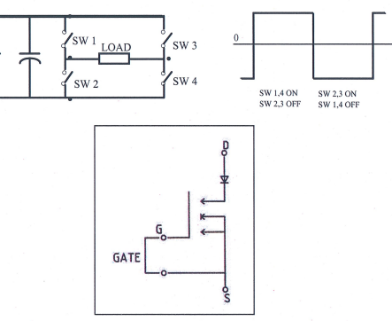
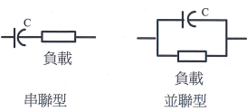
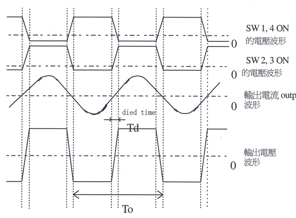
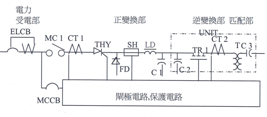
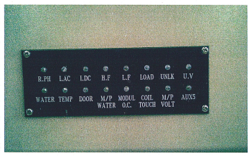
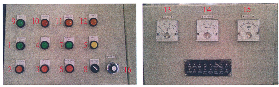
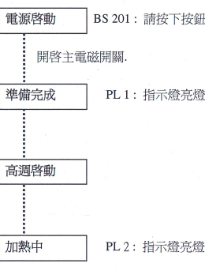
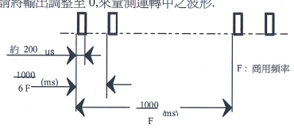
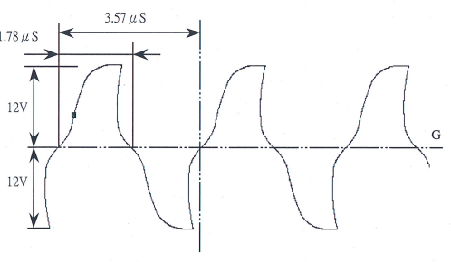
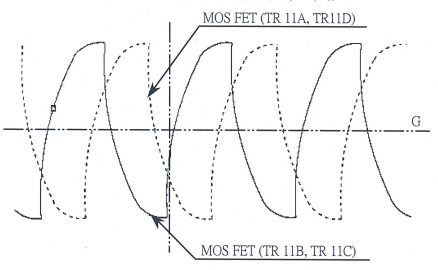

# 晶體式高頻電源

請務必在閱讀,理解本說明書後,再操作本電源.

客戶 交機地點 排序編號

H Isen

賀順企業股份有限公司
台灣省桃園縣龜山鄉萬壽路一段 540 號
電話:886-2-8209-0214
分機 261~263
傳真:886-2-8200-0692
E-mail:ken@mail.hisen.com.tw

## 目錄

###### end of page 1

|     |                      | 直數   |
|-----|----------------------|--------|
| 1.  | 注意事項            | 3      |
| 2.  | 定期檢查            | 5      |
| 3.  | INVERTER 原理        | 6      |
| 4.  | 本高頻電源特性  | 7      |
| 5.  | 主電路結構         | 9      |
| 6.  | 具常顯示內容         | 10     |
| 7.  | 操作開閣説明         | 11     |
| 8.  | 操作順序           | 12     |
| 9.  | 故障修理指引       | 13     |
| 10. | 半導體模組的檢測方法 | 21     |
| 11. | 半導體的更換方法     | 24     |
| 12. | 控制基板的更换方法   | 25     |
| 13. | 負載匹配調整         | 25     |

###### end of page 2

## 1. 注意事項

### 1 - 1 機器運轉時,請瀏守下列事項來操作。

(1) 請於供給源(電力,接地,冷卻水,淬火液,油壓,空壓等)在滿足規定範圍的 情況下,才使用本設備.
(2) 請勿在門開,或拆除保護封蓋,防水封板,外板等情況下操作,運轉.
(3) 請勿在變更,取消,開放保護[互鎖]電路等情況下操作,運轉.
(4) 請勿靠近通電中的高壓電路.
(5) 若在運轉中察覺有異常,應立即停止運轉。
(6) 請處裡規格範圍內之工件. (切勿處理規格範爲外之工件.)
(7) 請經常清理設備,務必在規定的環境下使用.
(8) 請在每次使用前檢查冷卻水是否正常.
(9) 切勿在機器運轉中,關閉循環水管(機器冷卻水)配管的閥.
(10) 在多季,若有結冰,且長時間停止運轉的可能,請事先完全去除設備內部的水,或探取其他預防結冰方法。
(11) 機器中關於水溫,溫度及基板上之旋扭或保護設定切勿自行更動

- 水溫開關設定為 40 度 C
- 機箱内溫度開關設定爲 55 度 C

### 1 - 2 在保養,調整時,請注意下列事項。

(1) 必須探取措施,避免其他人員入内.

(2) 因應各種作業,穿戴適當之保護衣具. (安全帽,安全鞋,護目鏡,手套等)
(3) 請以 2 人爲一組進行保養,調整作業.(彼此互相回應確認)
(4) 請確認指示燈(燈泡故障檢查)亮燈.
(5) 進行機箱內檢查時,請務必將切斷高頻電源,控制箱,匹配箱的主要無熔絲開關.
(6) 請注意無熔絲開關一次側帶電.
(7) 請探取禁止送電(高頻電源無熔絲總開關,控制箱之無熔絲總開闊)之措施
(8) 請確認已斷電.
(9) 請探取使高壓電路接地之措施.
(10) 請對電容等進行放電.(請與以接地)
(11) 針對有殘壓之機構(油壓,空壓,水壓),請先行去除殘壓後,再進行保養,調整作業.

###### end of page 3

(12) 在復電前,請檢查不要發生下列情況:

- 裝錯,忘記安裝,忘記鎖零件.
- 忘記取出工具.
- 忘記解除外加之接地措施.
- 忘記裝回保護封蓋,防水封蓋,外板
- 忘記恢復保護電路.

(13) 機器在運轉動作狀態下,若有必要調整或保養,請勿算近帶有電壓的部份.
(14) 在不得已,變更,解除,開放保護電路[互鎖電路]的情況下作業時,必須充份注意作業員的安全及機器的誤動作.作業完畢後,請務必回復原本正規之狀態.

(15) 在拆除外板,門,封蓋等安全裝置的狀態下,有必要進行送電,機械動作,加熱 動作時,請必須充份注意作業員的安全及機器的誤動作.
(16) 機器在調整中,若需離開現場,請關閉控制箱,及高頻電源的主要無熔絲開闊.

### 1 - 3 事故者之救助.[預防二次災害]

(1) 當觸電事故發生時,請馬上切斷主電源,並將電路接地.
(2) 若無法立即切斷電源,請儘快將觸電者與觸電處分離.此時絕不可直接碰觸 電處或觸電者.要接觸時請一定要使用乾布或絕緣物.此時要特別注意:高壓 電路有可能會發生弧光.

###### end of page 4

## 2. 定期檢查

雖然本機器之設計足以適應惡劣之作業環境及使用條件,但是爲了機器要 能使用更長久期間,有必要定期檢查.請參照 2-2 進行定期檢查.

2 - 1 安全對策 本機器已充份應用互鎖電路來作爲危險防範對策.基於安全起見.請注意以下 幾點.

(1) (2) 
2 = 
定期檢查。

絕不可在拆除門,冷卻水等的互鎖電路狀態下,讓機器運轉.

進行箱內檢查時,請務必切斷主電源開關.

| = 2 正期顾宜。        |                                                                                      |
|-----------------------|--------------------------------------------------------------------------------------|
| 日保養                | 1:水壓是否正常(進出水壓差 2kg/cm2 以上)                                              |
|                       | 2:電壓是否正常(AC380V+5%)                                                            |
|                       | 3:匹配箱後之水冷導線輸入板,中繼站左右兩片間及                                        |
| (開機前確認)          | COL之鐵粉及塵埃須清乾淨,以避免火花產生                                               |
|                       | 4:操作按鈕.旋紐開關及指示燈有無損壞 ] · 將匹配箱外部擦拭乾淨、連同匹配箱後之水冷專線 |
|                       | 所連接之電木板亦應擦拭乾淨                                                           |
|                       | 2:控制箱上之電錶及按钮、指示燈外殼也須擦拭清潔                                       |
| 週保養                | 3:將機器外觀擦拭乾淨                                                                 |
| (保養時應斷電         | 4:檢查機台有無漏水或結露情形,若有結露情況,                                           |
| 0                     | 則有必要提高冷卻水的溫度(最高35度C),或                                               |
|                       | 降低機箱內部溫度 1:蒸馏水箱是否水量足夠                                              |
| 月保養 (保養時應斷電) | 2:Y型濾水器需拆開清洗                                                                |
|                       | 3:檢查流量開關是否有動作                                                             |
|                       | 4:檢查門開闢是否有動作                                                               |
|                       | 5:檢查各部螺絲是否有鬆動                                                             |
| 年保養                | 1:管路清洗(包含内外水)【請參照管路清洗程序表】                                       |
| (保養時應斷電)        | 若水質太髒建議 1~3個月清洗一次                                                       |
|                       | 管路清洗程序                                                                         |
| 材料                  | 1:水管清洗劑(如頻果酸)                                                               |
|                       | 2:清水                                                                               |
| 使用比例              | 1·固體 5KG/ 000L                                                                     |
|                       | 2:液體 1250CC/1000L                                                                  |
|                       | 1:清洗劑加入水塔及水箱中                                                             |
|                       | 2:啟動 PUMP 運動(請勿啟動高週波機)                                                   |
|                       | 3:清洗時間約為15~20分(水呈現黑色)                                                    |
|                       | 4:漏掉"黑色"的水源,加入"乾淨"的水源                                                  |
| 步驟                  | 5:啟動 PUMP 清洗                                                                     |
|                       | 6:清洗時間約為 10~15分(水呈現淡黑色)                                                 |
|                       | 7:漏掉"混濁"的水源,加入"乾淨"的水源                                                  |
|                       | 8:重覆 4~7 約二次,使導轉後水源不再呈現污穢                                           |
|                       | 9:重新加入"蒸馏水"至满水位                                                           |

|          | :視管路污穢情形,決定使用"固體"或"液體" 或一篇   |
|----------|-------------------------------------------------|
|          | 使用                                            |
| 注意事項 | 2:清洗劑具有腐蝕性,故需清洗乾淨                 |
|          | 3:清洗劑清洗過程中,請勿超過太多時間             |

# 3. Inverter 的原理

連接於電源E的開闊群,隨著 SW1,SW2,SW3,SW4 交替 ON/OFF,可提供負載 如圖所示的交流電力.

此 INVERTER 之 SW1~4 是由自我關閉型的 MOS 晶體所構成,控制輸入 端子(GATE)借由外部所提供之信號,即由控制電路所產生的週期,脈衝波寬 幅的驅動電壓信號,來進行 ON/OFF.

# 本高頻電源特性

在感應式負載的情況,一般是由電容來做力率的補償,依補償電容與負載之連 接方式,可分爲申聯型與並聯型.

本電源是以串聯方式作負載力率的補償.

因此如圖所示:電流波形爲弦波,電壓波形爲方波.

再則,電壓,電流的相位差,只有依線路電感所定的停止時間,沒有像 S.C.R 所需 要的關閉時間因此可以高力率運轉,且減少損耗.

輸出電流 output current
為提高切換效率,有必要借由減少電壓電流的相位差,提高力率,來降低電流值, 進而減少主電路導體的導通損失.

為此由控制電路控制在電壓與電流無相位差時鎖定來進行運轉.高頻電源的主 要損耗當中切換損耗占有很大的比例.本高頻電源控制在當電壓接近零時切換.

因此大幅降低切换時產生之損失 又,因為使用自動關閉型元件,因此無需如 Thysistor 需要起動電路.也不會發生 負載誤切換而產生切換電流失敗.

# 5.主電路結構

## 5 - 1 結構區塊圖

## 5 - 2 各區塊圖之功能

構成主電路之主要區塊可大分為:受電部,正變換部,逆變換部.

## (1) 受電部

連接三相商用電源.

由主電路電源斷路器 ELCB,過電流檢測 CT,主電路用電磁接觸器 MC1 等 構成.進行主電路開關,及異常過電流時之切斷.

## (2) 正變換部

將交流電力轉換成直流電力.

由使用構成 6 相相位控制電路的 Thysistor(THY),飛輪二極體(FD),直流電 感器(LD)等構成.將交流轉換成直流,提供逆變換部.

## (3) 逆變換部:

將直流定電壓源作切換,轉換成高頻電力.

由 MOSFET(TR1)交互切換構成全橋切換電路,轉換成高頻電力.

## (4) 匹配部

將逆變換部之電壓轉換成負載所需之電壓,並進行力率補償.

## (5) 閘極電路,檢測電路

是爲主電路的控制,異常時的保護所需信號的介面.兼具與主電路絕源,及 進行信號的處理.

進行以下的保護動作.又,指示燈爲紅色,進行跳脫動作.

| 名 輝                | 符 號   | 内 容                                  |
|----------------------|---------|----------------------------------------|
| 欠逆相 (R.PH)        | LED1    | 三相主電路欠相或逆相時動作.            |
| 交流過電流(I.AC)     | LED2    | 商用輸入電流超過額定値以上時動作.      |
| 直流過電流(I.DC)     | LED3    | 直流電路過電流時動作.                  |
| 高頻 (H.F)           | LED4    | 共振頻率在規範値以上動作.              |
| 低頻(L.F)            | LEDS    | 共振頻率在規範値以下動作.              |
| 負載異常(LOAD)       | LED6    | 負載(加熱線圈,匹配電容等),突然(短路,斷 |
|                      |         | 路等)變化時動作.                       |
| 未鎖頻(UNLK)         | LED7    | 工作時未達到共振頻率時動作             |
| 電源低下(U.V)        | LED8    | 控制電源低下                           |
| 機箱水異常(WATER)    | LED9    | 電源設備的冷卻水量過低,或水溫過高.     |
| 溫度(TEMP)           | LED10   | 順變換 S.C.R.的冷卻銅板冷卻不足時動作  |
|                      |         | 及電源設備內溫度過高時動作             |
| 明 開 (DOOR)         | LED11   | 電源設備門打開時動作.                  |
| 匹配部水異常         | LED12   | 匹配部水量異常時動作                   |
| (M/P WATER)          |         |                                        |
| 模組過電流           | LED13   | 逆變換電路因短路等原因造成過電流時     |
| (MODUL O.C)          |         | 動作.                                  |
| 匹配部接地           | LED14   | 匹配部接地時動作.                      |
| (COIL TOUCH)         |         |                                        |
| 電容過電壓(M/P VOLT) | LED15   | 匹配用電容的電壓超出額定値.            |
| AUX5                 | LED16   | 三相輸入電壓過高或過低                 |

## 7. 操作開關說明

為能安全,確實的操作控制電路.

|              | 名 稱        | 符號        | 内 容                               |
|--------------|--------------|-------------|-------------------------------------|
|              | 1:電源啓動   | BS 201      | 主電路電磁接觸器(MC1)ON.            |
| 安           | 2:電源停止   | BS 202      | 主電路電磁接觸器(MC1)OFF.           |
| 新           | 3:高週停止   | BS 203      | 電源設備停止加熱                    |
|              | 4:高週啓動   | BS 204      | 電源設備啓動開始加熱                |
| 目           | 5:動作復歸   | BS205       | 異常時的復歸                        |
| 器           |              |             |                                     |
|              | 6:冷卻水停止 | BS 206      | 控制冷卻水馬達停止.                 |
|              | 7:冷卻水啓動 | BS 207(PL5) | 控制冷卻水馬達開始動作.             |
| \-百年       | 8:頻率切換   | SWI         | 切換高頻或低頻(並不是高速或低速)    |
| ਵਿੱ            |              |             | (一般切換至 LOW,若高週啓動後跳 UNLK |
| 調           |              |             | 則可切換至 HIGH,再行測試)           |
| 影           |              |             |                                     |
| 指           | 9:準備完成   | PL1         | 電源設備準備完成.                   |
| 示           | 10:加熱中    | PL 2        | 加熱時亮燈.                         |
| 燈           | 11:異常      | PL3         | 電源主機異常                        |
|              | 12:極限動作  | PL4         | 電壓極限動作                        |
| 13:電流表    |              | A           | 顯示直流電流.                       |
| 14:富屋表    |              | V           | 顯示直流電壓.                       |
| 15:頻率表    |              | F           | 顯示輸出頻率.                       |
| 16:功率旋钮: |              | VR          | 控制高週大小                        |

. 操作順序:於 BREAKER ON 後先按下冷卻水啓動再按下動作復歸,將異常解除後 即可按電源啓動,等準備完成燈亮後,即可按高週啓動,高週即輸出 A . 

# 操作順序

請打開冷卻水。

8 - 1
[電源設備<純水裝置>,匹配箱,加熱線圈等].

8 = 2 請檢查門是否關閉。

[電源設備,匹配箱]
以極限開關確認門關閉.

打開電源。

8 - 3 主 電 源 ELCB 1 : 開啓無熔絲開關.

## 8 = 4 啓動高週

# 9-1 主電源開啓時異常跳脫(Elcb).

|      | 検査項目   | 檢 查 內 容       | 制定 YES / NO   | 原因對策   |
|------|------------|-------------------|-----------------|------------|
|      |            |                   | () =>           |            |
|      | 漏電       | 主電路是否接地 ?  |                 | 修理       |
| 2 \| | 短路       | 主電路是否接地 ?  |                 | 不良       |
|      |            | (ELCB 1<>MC 1 間) |                 |            |

|        | 検査項目   | 檢 查 內 容            | 判定 YES / NO   | 原因對策   |
|--------|------------|------------------------|-----------------|------------|
|        |            |                        | ( ↓ ) :( \-> )  |            |
| 2 \- 1 | 門開       | 電源設備的門是否關閉?  |                 | 關門.      |
|        | (LED11)    | · CR22 是否動作?       |                 |            |
|        |            | · 是否接觸不良?(門開露 |                 | 総電器不良 |
|        |            | 走)                    |                 | 修理.      |

9-2 主電源(MC1)無法 ON.

|      |            |                         | 制定     |                        |
|------|------------|-------------------------|----------|------------------------|
|      | 檢查項目   | 檢查內容                | YES / NO | 原因 對 策             |
|      |            |                         | (↓)(→)   |                        |
| 3\-1 | 欠逆相     | ◎三相丰富路.            |          |                        |
|      | (LED1)     | · AC 輸入之相序是否正   |          | 修改配線.              |
|      |            | 確?                     |          |                        |
|      |            | · 配線等是否斷線 ?      |          | 修理。                 |
|      |            | · 漏電斷路器(ELCB 1)是  |          | 更換零件.              |
|      |            | 否動作正常 ?            |          |                        |
|      |            | ◎控制電路是否正常 ?     |          |                        |
|      |            |                         |          | 基板不良.              |
|      |            | · 控制基板 PB015 是否動 |          |                        |
|      |            | 作 ?                    |          |                        |
|      |            | · 是否有配線等接觸不    |          | 基板不良.              |
|      |            | 良 ?                    |          |                        |
|      |            | · 配線用電路保護器      |          | 確認接觸.              |
|      |            | (MCCB1)是否誤動作 ?     |          |                        |
|      |            |                         |          | 更換零件.              |
| 3\-2 | 電源低下 . | 檢查穩壓器是否正常      |          | 檢查電源輸入 AC 是否有 |
|      | (LED8)     |                         |          | 110V 檢查(105,106)     |
|      |            | 電源供應器是否正常      |          | 更換電源供應器         |
|      |            | · PB039 是否正常        |          | 更換 PB039             |
| 3\-3 | 機箱水異常 | · 是否已開啓冷卻水?     |          | 打開冷卻水.            |
|      | (LED9)     | · CR20 繼電器動作是否正 |          |                        |
|      |            | 常?                     |          | 繼電器不良→修理.       |
|      |            | 流量開關的配線,是否     |          | 檢查配線.              |
|      |            | 接觸不良?               |          |                        |
|      |            | · 水溫是否過高          |          | 檢查濾水器是否阻塞     |
|      |            | 冷卻系統有無通水 ?      |          | 冷卻系統通水.          |
|      |            | · 溫度開闊動作如何 ?    |          | 溫度開關不良. →更換.   |
|      |            | · 是否有配線等接觸不    |          | 検査配線               |
|      |            | 良 ?                    |          |                        |

|      | 検査項目     | 檢 查 內 容                           | 判定 YES / NO    | 原因 對 策                              |
|------|--------------|---------------------------------------|------------------|-----------------------------------------|
| 3\-4 | 溫度 (LED10) | " 冷氣運作如何?                       | ( ↓ ) :( \-> ) → | 冷氣運作不良. 清理或保養                |
|      |              | · 溫度開關動作如何 ?                  |                  | 溫度開關不良. →更換.                    |
|      |              | · 檢查水冷銅板是否正 常               |                  | 水路閥門是否有開啓及 水冷銅板是否有堵塞 |
|      |              | · 是否有配線等接觸不 良 ?             |                  | 検査配線                                |
| 3\-5 | 匹配部水異常 | ロ 是否已開啓冷卻水?                  | 1                | 打開冷卻水.                             |
|      | (LED12)      | 繼電器動作是否正常?                   |                  | 繼電器不良→修理.                        |
|      |              | 流量開闊的配線,是否 接觸不良?         |                  | 檢查配線.                               |
|      |              | 水溫是否過高                          |                  | 冷卻系統通水.                           |
|      |              | 冷卻系統有無通水 ? 溫度開闊動作如何 ? |                  | 溫度開關不良. →更換.                    |
|      |              | 是否有配線等接觸不 良 ?               |                  | 検査配線                                |

|        | 検査項目   | 檢查內容                         | 判定 YES / NO   | 原因對策               |
|--------|------------|----------------------------------|-----------------|------------------------|
|        |            |                                  | (↓)(→)          |                        |
| 4 \- 1 | 交流過電流 | ◎確認面盤上的電表數值            |                 |                        |
|        | (LED2)     | (直流電壓,電流,頻率).            |                 |                        |
|        |            | · 確認當輸出調整從 0%            |                 |                        |
|        |            | 上升至多少時動作 ..              |                 |                        |
|        |            | ◎主電路是否正常 ? · 三相相位電路 | 1               | 更換不良零件.          |
|        |            | thvristor (THY 1~6) 電容(C 1)    |                 |                        |
|        |            | 雷阴(R 1)                        |                 |                        |
|        |            | ◎控制電路是否正常 ?              | 1               | Replace the bad part.  |
|        |            | · 檢測 CT (CT 1~6)               |                 | CT 不良.               |
|        |            | - 控制基板(PB015)動作?           |                 | 基板不良.              |
|        |            | · 是否配線等接觸不良 ?           | 1 1             | 修理.                  |
| 4 \- 2 | 直流過電流 | ◎主電路是否正常 ?                |                 | 更换不良零件.          |
|        | (LED3)     | · 直流電路(配線)                 |                 |                        |
|        |            | ◎控制電路是否正常 ?              |                 | SH 不良.               |
|        |            | 検測分流器(SH 1)                 |                 | 基板不良               |
|        |            | ◎ 檢查 MOS,SNUBBER               |                 | 修理                   |
|        |            | 是否有損壞                       |                 | 語參照 MOS 及          |
|        |            |                                  |                 | SNUBBER                |
|        |            |                                  |                 | 檢測方法檢查並更換損壞 |
|        |            |                                  |                 | 零件                   |

|      | 検査項目           | 檢查內容                                                                                                                  | 判定 YES / NO (↓)(→)   | 原因 對 策                                             |
|------|--------------------|---------------------------------------------------------------------------------------------------------------------------|------------------------|--------------------------------------------------------|
| 4\-3 | 模組過電流 (LED13) | · Inverter 電路 · 匹配變壓器(MTR 1)                                                                                       |                        | 更换不良零件.                                          |
|      |                    | · 匹配電容 " MTr. · 加熱線圈。 · 水冷導線,銅板等. (※是否燒毁) ◎控制電路是否正常 ? - 控制基板(AB3757) · RF 絕緣基板(PB039) |                        | 修理 請參照 MOS 及 SNUBBER 檢測方法檢查並更換損 壊零件 |
|      |                    | 1(PB033 B) · RF 驅動基板                                                                                                  |                        |                                                        |
|      |                    | ◎檢查 MOS,SNUBBER 是否有損壞                                                                                              |                        |                                                        |

|       | 檢查項目   | 檢查內容                | 判定 YES / NO   | 原因 對 策      |
|-------|------------|-------------------------|-----------------|-----------------|
|       |            |                         | (↓)(→)          |                 |
| 4 \-4 | 電容過電壓 | ○確認面盤上的電表數值   |                 |                 |
|       | (LED15)    | (直流電壓,電流,頻率).   |                 |                 |
|       |            | ·確認當輸出調整從 0%上  |                 |                 |
|       |            | 升至多少時動作.         |                 |                 |
|       |            | · 材料與加熱線圈的尺寸  |                 |                 |
|       |            | 是否相配 ?              |                 | 更改成正規尺寸. |
|       |            | · 加熱線圈與 MTr.是否接 |                 |                 |
|       |            | 觸不良 ?                |                 | 鎖緊.           |
|       |            | · 水冷導線是否接處不良, |                 |                 |
|       |            | 斷線 ?                  |                 | 修理.           |
|       |            | · 輸出銅板等是否接觸不  |                 |                 |
|       |            | 良 ?                    |                 | 鎖緊.           |
|       |            | · 電壓檢測用電容是否正  |                 |                 |
|       |            | 常 ?                    |                 | 更换不良零件.   |
|       |            | · 電容電壓檢測基板      |                 |                 |
|       |            | (RF810)的電阻是否正     |                 |                 |
|       |            | 常 ?                    |                 | 更換不良零件.   |
|       |            | ·過電壓繼電器(OVR)的動  |                 |                 |
|       |            | 作如何 ?                |                 | 更换不良零件.   |
|       |            | · 配線等是否接觸不良 ?  |                 | 修理.           |

|        | 検査項目   | 檢查內容                | 判定 YES / NO   | 原因對策        |
|--------|------------|-------------------------|-----------------|-----------------|
|        |            |                         | (↓)(→)          |                 |
| 4 \- 5 | 匹配部接地 | 在配箱的匹配變壓        |                 | 更換不良零件    |
|        | (LED14)    | 器的二次側電路是        |                 |                 |
|        |            | 否接地?                 |                 |                 |
|        |            | 匹配電容                |                 |                 |
|        |            | 匹配電容的匯流銅板      |                 |                 |
|        |            | 水冷専線                |                 |                 |
|        |            | 高頻 MTr.               |                 |                 |
|        |            | (※是否燒毁?)            |                 |                 |
|        |            | · COIL 接地檢測基板的動 |                 | 基板不良.       |
|        |            | 作如何 ?                | 1               | CT 不良         |
|        |            | · 檢測 CT 是否正常 ?    |                 | 修理.           |
|        |            | · 配線等是否接觸不良 ?  |                 |                 |
| 4\-6   | 高頻       | ○.確認面盤上的電表數值  |                 |                 |
|        | (LED4)     | (直流電壓,電流,頻率).   |                 |                 |
|        |            | ·確認當輸出調整從 0%上  |                 |                 |
|        |            | 升至多少時動作          |                 |                 |
|        |            | · 材料與加熱線圈的尺寸  |                 | 更改為正規尺寸. |
|        |            | 是否相配 ? .            |                 |                 |
|        |            | ·加熱線圈之圈與圈之間   |                 |                 |
|        |            | 是否短路 ?              |                 | 更換 COIL.      |
|        |            | · 加熱線圈之連接銅板處  |                 |                 |
|        |            | 是否短路 ?              |                 | 修理.           |
|        |            | · 輸出銅板,水冷導線等是 |                 |                 |
|        |            | 否短路 ?(有無燒煅?)     |                 | 修理.           |
|        |            | 트 PB016 控制基板動作   |                 | 更換基板.       |
|        |            | 是否正常?               |                 |                 |
|        |            | - 檢測震盪電容有無損    |                 | 更換損壞之電容  |
|        |            | 壊                      |                 |                 |

|       | 検査項目             | 檢查 內 容                                  | 制定 YES / NO   | 原因對策             |
|-------|----------------------|---------------------------------------------|-----------------|----------------------|
|       |                      |                                             | (↓)(→)          |                      |
| 4\-7  | 低頻                 | ○確認面盤上的電表數值                       |                 |                      |
|       | (LED5)               | (直流電壓,電流,頻率).                       |                 |                      |
|       |                      | ·確認當輸出調整從 0%上                      |                 |                      |
|       |                      | 升至多少時動作                              |                 |                      |
|       |                      | · 材料與加熱線圈的尺寸                      |                 | 更改為正規尺寸.      |
|       |                      | 是否相配 ?                                  |                 |                      |
|       |                      | · 加熱線圈與 MTr.是否接                     |                 | 更換 COIL.           |
|       |                      | 觸不良 ?                                    |                 |                      |
|       |                      | - 水冷導線是否接觸不良                      |                 | 修理。               |
|       |                      | 或斷線 ?                                    |                 |                      |
|       |                      | · 輸出銅板,水冷導線等是 否短路 ?(有無燒嫂?) |                 | 修理.                |
|       |                      | · 控制基板(PB016)動作是                     |                 | 更換基板.            |
|       |                      | 否正常?                                     |                 |                      |
| 4\-8  | 未鎖頻               | 確認 COIL 是否有鎖緊                        |                 | 親談                 |
|       | u (LED7)             | 加熱線圈的尺寸是否                          |                 | 更換 COIL            |
|       |                      | 相配 ?                                      |                 |                      |
|       | ロ                   | 檢查 MOS.SNUBBER                            |                 | 請參照 MOS 及        |
|       |                      | 是否有損壞                                  |                 | SNUBBER              |
|       |                      |                                             |                 | 檢測方法檢查並更換損 |
|       |                      |                                             |                 | 壊零件               |
| 4 \-9 | 負載異常             | 確認面盤上的電表數值                        |                 |                      |
|       | (LED6)               | (直流電壓,電流,頻率).                       |                 |                      |
|       |                      | ·確認當輸出調整從 0%上                      |                 |                      |
|       |                      | 升至多少時動作                              |                 |                      |
|       |                      | · 材料與加熱線圈的尺寸                      |                 |                      |
|       |                      | 是否相配 ?                                  |                 | 更改爲正規尺寸.      |
|       |                      | · 加熱線圈是否有接觸不                      |                 |                      |
|       |                      | 良或短路情況 ?                              |                 | 更換 COIL.           |
|       |                      | · 水冷導線是否接觸不良,                     |                 |                      |
|       |                      | 斷線或斷線 ?                                |                 | 修理.                |
|       |                      | · 輸出銅板等有無接觸不                      |                 |                      |
|       |                      | 良或短路 ?(有無燒殿?)                       |                 | 修理                 |
|       |                      | 控制基板(PB016 動作                         |                 |                      |
|       |                      | 是今上官?                                   |                 | 更換基板.            |
|       |                      | 檢查 MOS.SNUBBER                            |                 | 更換損壞零件         |
|       |                      | 是否有損壞                                  |                 |                      |
| 10.   | 半導體模組的檢查方法 |                                             |                 |                      |

※ 1 請注意當把閘極拔除時,爲避免靜電等的高電壓加諸於間極上,請將 G-S 間作短路.

2 將主斷路器關閉後,由於尙有電荷殘留在閘極電路上,請於 2~3 分鐘後 再行測量.

## 10-1 檢查方法

高頻電源在運轉中因異常狀況而停止時,請先記錄控制箱上亮異常燈的內 容。

"DC 保險絲斷"的異常指示燈亮燈時,因半導體有可能已損壞,請在進行電阻 值檢查後,再重新運轉.

## 10 - 2 正變換 S.C.R Thy 1~6 的電阻値檢查

※ 使用指針型電表 (歐姆檔:×1Ω)
 
(1)  針對各 S.C.R 交替檢查  [陽極] A(+)與[陰極] K (-),然後  A (一)與 K (+)
確定電阻值皆爲 ∞Ω .

若是電阻值非常低時,重主電路拆除 A 與 K ,再行測試.

(2) [GATE] G-K 間(正常)
( 務必與主基板分離後再量測)
∞Ω:閘極開路, 0Ω:開極短路.

## 10 - 3 二極體電阻值檢查

(1) 飛輪二極體 使用電表,檔位:×1Ω2 1 安裝完成狀態:A(+) - K(-)
∞ Ω
(2)
:A(-) - K(+)
數十 Ω
極端不同的情況下,請拆下再次檢查.

## (1) 直流電路

| 電表的極性     |                     | 電阻値   |
|----------------|---------------------|----------|
| 十 枸          | 一 枸               |          |
| 直流輸入+(P4)  | 直流輸入一 \- (N 4) | 數十 2   |
| 直流輸入一(N4) | 直流輸入十 (P 4     | 00       |

## (2)

| TTT + HEHT FAT HE . 電表的極性   |                | 電阻値   |
|----------------------------------|----------------|----------|
| +side                            | \-side         |          |
| MOS FET D 端子                   | MOS FET S 端子 | 動物     |
| MOS FET S 端子                   | MOS FET D 端子 | 00       |
| MOS FET S 端子                   | MOS FET G 端子 | 300 Ω    |

MOS FET 單體的電阻值檢查.

* 請檢查所有的 MOS FET.

電阻值為 0Ω時,表示該 MOS FET 已損壞.

再則,各區塊中若有 MOSFET 損壞,因為輸出變壓器的影響,無法作正確量 測,所以請務必先將不良的 MOSFET 從接續銅板上拆除後,再作檢測.

(10. INSPECTION METHOD on SEMICONDUCTOR MODULE -Continued )

## 10 - 5 檢查正變換閘極波形

量測閘極驅動基板 AB3631 端子時,由於主電路電壓會加諸於測量儀器的機 殼上.在測量時,請多加注意.

## 10-6 檢查逆變換部開極波形。

(1) 量測逆變換部閘極波形.

在主電路 ON(MC1 ON)時逆變換部輸出閘極波形.

★ 量測閘極波形
(1) 主電路 ON (MC 1 ON).

② 使用示波器量測 MOS FET TR 1A~10 A, TR 1 B~10B,TR 1 C~10 C,TR
1 D~10 D 之 G = S 間波形,確認波形與圖 1 波形幾近相同.

從 PB033B 的輸出端子 G - S 來量測閘極波形較爲簡單.

波行不同時,請更換閘極驅動基板 PB033B .

在逆變換部更換 MOS FET 時,請確認開極脈沖波的極性.

(2) 檢查開極極性 1) 將示波器的 CH1 的探棒接地夾頭,接於負端的匯流銅板上(N 4). 2 將 CH1 探棒本體接於 TR 1 A 的 G1 上. 3 將 CH2 探棒本體接於 TR 1 B 的 G1 上.

(4 請確認示波器的波形如圖 2 所示,CH1與 CH2 有 180° 的相位差.

5 根據此檢測方法,檢查所有以匯流銅板 N 1 爲共同點的 MOSFET.

同樣的,針對下列 MOSFET 量測閘極脈沖波,也請確認 CH1 與 CH2 的波形 有 180°的相位差.

| 11 14                          |           |           |
|--------------------------------|-----------|-----------|
|                                | Probe     |           |
|                                | Channel 1 | Channel 2 |
|                                | TR 1 A    | TR 1 B    |
|                                | TR 1 C    | TR 1 D    |
|                                | TR 2 A    | TR 2 B    |
|                                | TR 2 C    | TR 2 D    |
|                                | TR 3 A    | TR 3 B    |
| Name of GATE                   | TR 3 C    | TR 3 D    |
|                                | TR 4 A    | TR 4 B    |
|                                | TR 14 C   | TR 4 D    |
|                                | TR 5 A    | TR 5 B    |
|                                | TR 5 C    | TR 5 D    |
| \-\-\-\-\-\-\-\-\-\-\-\-\-\-\- | A . P     |           |

## 圖 1 逆變換

MOS FET 閘極波形(G,S 間)
At the frequency 280 Hz with the installation of 200 Hz

(11. REPLACEMENT METHOD of SEMICONDUCTOR )

11 - 1 柱型二極體及 S.C.R.的更換方法
(1) 拆除.

拆除連接線,閘極電線,使用板手等拆除.

(2) 安裝.

首先,用布將螺牙及散熱部擦拭乾淨,之後在散熱部塗上薄薄的一層散熱 膏,然後,使用螺旋轉矩板手依指定的壓力旋緊.

確實連接,鎖緊陰極,閘極導線.

## 11 - 2 正變換 S.C.R.的更換方法

(1) S.C.R.模組 1 拆除.

拆除連接導線,閘極導線,鬆開固定夾後取下.

2 安裝.

首先,用布將螺牙及散熱部擦拭乾淨,之後在散熱部塗上薄薄的一層散熱 膏,然後,使用螺旋轉矩板手依指定的壓力旋緊.

閘極分為 6 組,請務必十分注意不要接錯位置.

# 11 - 3 逆變換晶體模組之更換方法

## (1) 拆除

拆除連接銅板.

由於閘極爲 MOS 結構,絕不可直接用手接觸,務必在戴上防靜電手套, 及 G - S 間短路的狀態下才可拆除晶體模組.

A . . . . . .

## (2) 安裝.

首先,用布將冷卻銅板面,及晶體面擦拭乾淨,之後在散熱部塗上薄薄的一

層散熱膏,然後,使用螺旋轉矩板手依指定的壓力旋緊.

1 在固定閘極驅動基板晶體時,與拆除時相同:絕不可直接用手接觸.

2 在安裝時,請特別注意不要弄錯固定位置和極性。

(註):推薦下列散熱膏.

型號 ;日輕 JOINTAL Z
經銷商;日輕化工株式會社 製造廠;靜岡興業株式會社
(12. REPLACEMENT METHOD of PRINT-CIRCUIT BOARD)

# 12. 基板[Pcb]的更換方法

基板內零件使用很多耐靜電弱的 C.MOS IC,在拆裝時務必特別注意 .

在更換,保存時,儘量避免直接用手接觸板面,以握持基板的端面爲原則.

## 12 - 1 關於拆裝基板。

確定已切段電源,電壓已降至 0 伏特.由接頭處拆除電腦排線.從設備內來 拆除基板.

安裝時以相反的程序進行確定接線正確後再送電.

由於電腦排線容易受損,處理時請特別注意.

# 13. 負載匹配調整

Inverter 的動作一直是在負載共振頻率附近動作.

因此有必要確認負載電路的匹配狀態 -- 電路阻抗是否適當.

VM 201; 電壓 FM 201; 頻率 AM 201; 電流

|                | 匹配變壓器   |        |
|----------------|--------------|--------|
|                | 一次側       |        |
|                | (M. Tr)      |        |
| Low Z(低阻抗)  |              |        |
| VM 201; 低     |              | (升高) |
| AM 201;高      |              |        |
| High Z(高阻抗) |              |        |
| VM 201;高      |              | (降低) |
| AM 201;低      |              |        |
