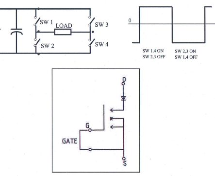
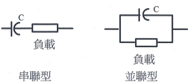
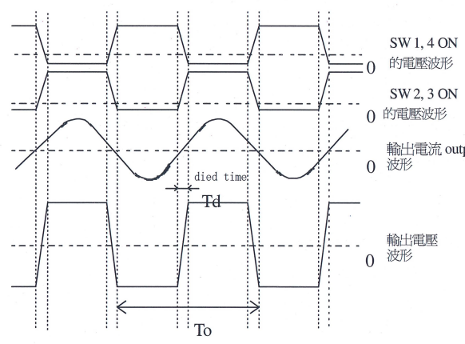
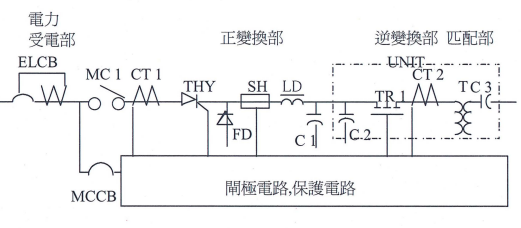
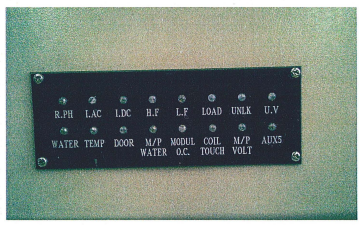
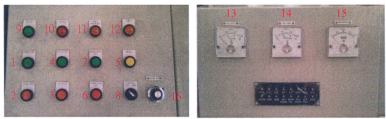
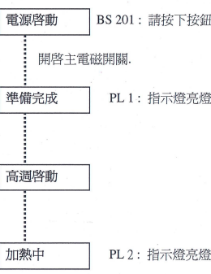
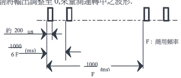
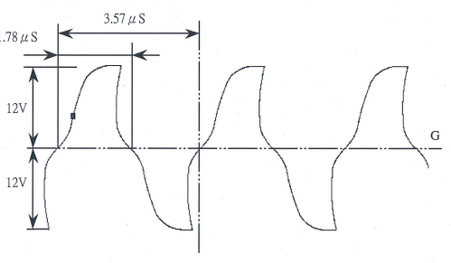
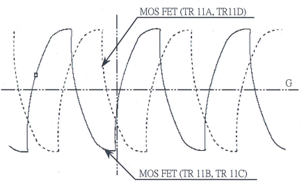

\ ·- \ 

晶體式高頻電源 請務必在閱讀,理解本說明書後,再操作本電源.

交機地點 排序編號

# Hisen

賀順企業股份有限公司 台灣省桃園縣龜山鄉萬壽路 540 電話886-2-8209-0214 分機 261~263 傳真886-2-8200-0692 E-mail:ken@mail.hisen.com. tw 1 目錄

| 1.   | 注意事項                                                                                                                                                    |    |
|------|-------------------------------------------------------------------------------------------------------------------------------------------------------------|----|
| 2.   | 定期檢查                                                                                                                                                    |    |
| 3.   | INVERTER  原理                                                                                                                                              |    |
| 4.   | 本高頻電源特性                                                                                                                                              |    |
| 5.   | 主電路結構...................................................................... 6789 | 9  |
|      | 異常顯示內容                                                                                                                                                | 10 |
|      | 操作開關說明                                                                                                                                                | 11 |
|      | 操作順序                                                                                                                                                    | 12 |
|      | 故障修理指引                                                                                                                                                | 13 |
| 10.  | 半導體模組的檢測方法                                                                                                                                        | 21 |
| 11.  | 半導體的更換方法..………..…… ……                                                                                                                            | 24 |
| 12.  | 控制基板的更換方法                                                                                                                                          | 25 |
| 13.  | 負載匹配調整                                                                                                                                                | 25 |

### 1-1 機器運轉時,請遵守下列事項來操作.

(1) 請於供給源(電力,接地,冷卻水,淬火液,油壓,空壓等)在滿足規定範圍的 情況下,才使用本設備
(2) 請勿在門開或拆除保護封蓋,防水封板,外板等情況下操作,運轉
(3) 請勿在變更,取消,開放保護[互鎖]電路等情況下操作,運轉. (4) 請勿靠近通電中的高壓電路.

(5) 若在運轉中察覺有異常,應立即停止運轉.

(6) 請處裡規格範圍內之工件.(切勿處理規格範為外之工件.) (7) 請經常清理設備,務必在規定的環境下使用.

(8) 請在每次使用前檢査冷卻水是否正常.

(9) 切勿在機器運轉中,關閉循環水管(機器冷卻水)配管的閥. (10) 在冬季,若有結冰,且長時間停止運轉的可能,請事先完全去除設備內部的水, 或採取其他預防結冰方法
(11) 機器中關於水溫,溫度及基板上之旋扭或保護設定切勿自行更動 水溫開關設定爲 40 機箱內溫度開關設定為 55

### 1-2 在保養,調整時,請注意下列事項.

(1) 必須採取措施,避免其他人員入內
(2) 因應各種作業,穿戴適當之保護衣具.(安全帽,安全鞋,護目鏡,手套等) (3) 請以 人為一組進行保養,調整作業.(彼此互相回應確認) (4) 請確認指示燈(燈泡故障檢查)亮燈. (5) 進行機箱內檢查時,請務必將切斷高頻電源,控制箱,匹配箱的主要無熔絲開 關.

(6) 請注意無熔絲開關一次側帶電. (7) 請採取禁止送電(高頻電源無熔絲總開關,控制箱之無熔絲總開關)之 措施
(8) 請確認已斷電
(9) 請採取使高壓電路接地之措施.

(10) 請對電容等進行放電(請與以接地)
(11) 針對有殘壓之機構(油壓,空壓,水壓),請先行去除殘壓後,再進行保養調整作 業.

(12) 在復電前,請檢查不要發生下列情況:
. 裝鑄忘記安裝忘記鎖零件.

. 忘記取出工具.

. 忘記解除外加之接地措施.

. 忘記裝回保護封蓋,防水封蓋,外板
. 忘記恢復保護電路.

(13) 機器在運轉動作狀態下,若有必要調整或保養,請勿靠近帶有電壓的部份.

(14) 在不得已,變更,解除,開放保護電路[互鎖電路]的情況下作業時,必須充份注 意作業員的安全及機器的誤動作.作業完畢後,請務必回復原本正規之狀 態.

(15) 在拆除外板,門,封蓋等安全裝置的狀態下,有必要進行送電,機械動作,加熱 動作時,請必須充份注意作業員的安全及機器的誤動作.

(16) 機器在調整中,若需離開現場請關閉控制箱,及高頻電源的主要無熔絲開關.

### 1-3 事故者之救助.[預防二次災害]

(1) 當觸電事故發生時,請馬上切斷主電源,並將電路接地. (2) 若無法立即切斷電源,請儘快將觸電者與觸電處分離.此時絕不可直接碰觸 電處或觸電者要接觸時請一定要使用乾布或絕緣物.此時要特別注意:高壓 電路有可能會發生弧光.

# 2. 定期檢查

雖然本機器之設計足以適應惡劣之作業環境及使用條件,但是為了機器要 能使用更長久期間,有必要定期檢查.請參照 2-2 進行定期檢查.

2-1 安全對策 本機器已充份應用互鎖電路來作為危險防範對策.基於安全起見,請注意以下 幾點
(1) 絕不可在拆除門,冷卻水等的互鎖電路狀態下,讓機器運轉.

(2) 進行箱內檢查時,請務必切斷主電源開關.

|                  | :水壓是否正當(進出水壓差 2k  /cm2 以上)                                          |
|------------------|-------------------------------------------------------------------------------------|
| 日保養           | :電壓是否正當 (AC380V  5%)                                                         |
|                  | :匹配箱後之水冷導線輸入板,中繼玷左右兩片間及                                      |
| (開機前嘩認)   | COIL 之鐵粉及塵埃須清乾淨,以避免火花產生                                           |
|                  | :操作按鈕.旋紐開關及指示燈有無損壞 :將匹配箱外部擦拭乾淨、連同匹配箱後之水冷導線 |
|                  | 所連接之電木板亦應擦拭乾淨                                                          |
| 週保養           | :控制箱上之電錶及按鈕、指示燈外殼也須擦拭清潔                                      |
|                  | :將機器外覬擦拭乾淨                                                                |
| (保養時應斷電) | :檢查機台有無漏水或結露情形,若有結露情況,                                        |
|                  | 則有必要提高冷卻水的溫度(最高 35  ),                                               |
|                  | 降低機箱內部温度                                                                    |
|                  | :蒸餾水箱是否水量足夠 2:Y 型濾水器需拆開清洗                                       |
| 月保養           |                                                                                     |
|                  | :檢查流量開關是否有動作                                                            |
| (保養時應斷電) | :檢查門開關是否有動作                                                              |
|                  | :檢查各部螺絲是否有鬆動                                                            |
| 年保養           | :管路清洗(包含內外水)【請參照管路清洗程序表】                                    |
| (保養時應斷電) | 若水質太髒建議 1~3 個月清洗一次                                                     |
|                  | 管路清洗程序                                                                        |
| 材料             | :水管清洗劑(如蘋果酸)                                                            |
|                  | 2: 清水                                                                             |
| 使用比例         | :固體  5KG/1000L                                                                   |
|                  | :液體  1250CC/IOOOL                                                                |
|                  | :清洗劑加入水塔及水箱中 :啟動 PUMP 運動(請勿啟動高週波機)                       |
|                  | :清洗時間約為 15~20 分(水呈現黑色)                                               |
|                  | :漏掉"黑色"的水源,加入"乾淨"的水源                                            |
| 步驟             | :啟動 PUMP 清洗                                                                    |
|                  | :清洗時間約為 10~15 分(水呈現淡黑色)                                             |
|                  | :漏掉"混濁"的水源,加入"乾淨"的水源                                            |
|                  | :重霞 4~7 約二次,使運轉後水源不再呈現污穢                                         |
|                  | :重新加入"蒸餾水"至滿水位                                                        |

|          | :視管路污穢情形,決定使用"固體"或"液體"或一齊   |
|----------|------------------------------------------------------|
| 注意事項 | 使用                                                 |
|          | :清洗劑具有腐蝕性,故需清洗乾淨                     |
|          | :清洗劑清洗過程中,請勿超過太多時間                 |

### 3. Inverter 的原理

連接於電源 的開關群,隨著 SW1,SW2,SW3,SW4 交替 ON/OFF,可提供負載 如圖所示的交流電力.

INVERTER SWl~4 是由自我關閉型的 MOS 晶體所構成,控制輸入 端子(GATE)借由外部所提供之信號,即由控制電路所產生的週期,脈衝波寬 幅的驅動電壓信號,來進行 ON/OFF.

` - .: ` 

#### 4. 本高頻電源特性

在感應式負載的情況,一般是由電容來做力率的補償,依補償電容與負載之連 接方式,可分為串聯型與並聯型.

本電源是以串聯方式作負載力率的補償.

因此如圖所示:電流波形為弦波,電壓波形為方波.

再則電壓,電流的相位差,只有依線路電感所定的停止時間沒有像 S.C.R 所需 要的關閉時間因此可以高力率運轉,且減少損耗.

#### .,.

為提高切換效率,有必要借由減少電壓電流的相位差,提高力率,來降低電流值, 進而減少主電路導體的導通損失.

為此由控制電路控制在電壓與電流無相位差時鎖定來進行運轉.高頻電源的主 要損耗當中切換損耗占有很大的比例.本高頻電源控制在當電壓接近零時切換.

因此大幅降低切換時產生之損失 又,因為使用自動關閉型元件,因此無需如 Th or 需要起動電路.也不會發生 負載誤切換而產生切換電流失敗.

#### .主電路結構 5-1 結構區塊圖

#### 5-2 各區塊圖之功能

構成主電路之主要區塊可大分為:受電部,正變換部,逆變換部.

#### (1) 受電部

連接三相商用電源.

由主電路電源斷路器 ELCB ,過電流檢測 CT,主電路用電磁接觸器 MCl 構成進行主電路開關及異常過電流時之切斷.

#### (2) 正變換部

將交流電力轉換成直流電力.

由使用構成 相相位控制電路的 Th or(THY),飛輪二極體(FD),直流電 感器(LD)等構成.將交流轉換成直流,提供逆變換部.

#### (3) 逆變換部

將直流定電壓源作切換,轉換成高頻電力.

MOSFET(TRl)交互切換構成全橋切換電路,轉換成高頻電力.

#### (4) 匹配部

將逆變換部之電壓轉換成負載所需之電壓,並進行力率補償.

#### (5) 閘極電路,檢測電路

是為主電路的控制,異常時的保護所需信號的介面.兼具與主電路絕源,及 進行信號的處理.

#### 6. 異常表示內容

進行以下的保護動作.又,指示燈為紅色,進行跳脫動作.

|                       | 符號   |                                            |
|-----------------------|--------|--------------------------------------------|
| 欠逆相 (R.PH)         | LEDl   | 三相主電路欠相或逆相時動作.               |
| 交流過電流(I.AC)      | LED2   | 商用輸入電流超過額定值以上時動作.         |
| 直流過電流(I.DC)      | LED3   | 直流電路過電流時動作.                     |
| 高頻 (H.F)            | LED4   | 共振頻率在規範值以上動作.                 |
| 低頻 (L.F)            | LED5   | 共振頻率在規範值以下動作.                 |
| 負載異常 (LOAD)       | LED6   | 負載(加熱線圈匹配電容等),突然(短路,斷 |
|                       |        | 路等)變化時動作.                         |
| 未鎖頻 (UNLK)         | LED7   | 工作時未達到共振頻率時動作                 |
| 電源低下 (U.V)        | LED8   | 控制電源低下                               |
| 機箱水異常 (WATER)    | LED9   | 電源設備的冷卻水量過低,或水溫過高.       |
| 溫度 (TEMP)           | LEDlO  | 順變換 S.C.R的冷卻銅板冷卻不足時動作       |
|                       |        | 及電源設備內溫度過高時動作                 |
| 門開 (DOOR)           | LEDll  | 電源設備門打開時動作.                     |
| 匹配部水異常          | LED12  | 匹配部水量異常時動作                       |
| (M/P WATER)           |        |                                            |
| 模組過電流            | LED13  | 逆變換電路因短路等原因造成過電流時         |
| (MODULO.C)            |        | 動作.                                     |
| 匹配部接地            | LED14  | 匹配部接地時動作.                         |
| (COIL TOUCH)          |        |                                            |
| 電容過電壓 (M/P VOLT) | LED15  | 匹配用電容的電壓超出額定值.               |
| AUX5                  | LED16  | 三相輸入電壓過高或過低                     |

7. 操作開關說明 為能安全,確實的操作控制電路.

| \             | 名稱         | 符號   |                                                                                                       |
|---------------|--------------|--------|-------------------------------------------------------------------------------------------------------|
|               | :電源啓動   | BS 201 | 主電路電磁接觸器(MCl)ON.                                                                              |
|               | :電源停止   | BS 202 | 主電路電磁接觸器(MCl)OFF.                                                                             |
|               | :高週停止   | BS 203 | 電源設備停止加熱                                                                                      |
|               | :高週啓動   | BS 204 | 電源設備啓動開始加熱                                                                                  |
|               | :動作復歸   | BS205  | 異常時的復歸                                                                                          |
|               | :冷卻水停止 | BS 206 | 控制冷卻水馬達停止.                                                                                  |
|               | :冷卻水啓動 |        | BS 207(PL5) 控制冷卻水馬達開始動作.                                                                  |
|               | :頻率切換   | SWl    | 切換高頻或低頻(並不是高速或低速) (一般切換至 LOW,若高週啓動後跳 UNLK  則可切換至 HIGH,再行測試) |
| :準備完成    |              | PLl    | 電源設備準備完成.                                                                                    |
| 10 :加熱中   |              | PL2    | 加熱時亮燈.                                                                                          |
| 11 :異常     |              | PL3    | 電源主機異常                                                                                          |
| 12 :極限動作 |              | PL4    | 電壓極限動作                                                                                          |
| 13 :電流表   |              | A      | 顯示直流電流.                                                                                        |
| 14 電壓表     |              | V      | 顯示直流電壓.                                                                                        |
| 15 :頻率表   |              | F      | 顯示輸出頻率.                                                                                        |
| 16 :功率旋鈕 |              | VR     | 控制高週大小                                                                                          |

.操作順序:於 BREAKER ON 後先按下冷卻水啓動再按下動作復歸,將異常解除後 即可按電源啓動,等準備完成燈亮後,即可按高週啓動,高週即輸出
` ` 

# 8. 操作順序

8-1 請打開冷卻水.

[電源設備<純水裝置>,匹配箱,加熱線圈等].

8-2 請檢査門是否關閉.

[電源設備,匹配箱]
以極限開關確認門關閉 8-3 打開電源.

|主 ELCB 1: 開啓無熔絲開關

#### 8-4 啓動高週

#### `'\

### 9-1 主電源開啓時異常跳脫(Elcb).

|        | 檢査項目   | 檢査內容          | 判定 YES/NO   | 原因對策   |
|--------|------------|-------------------|---------------|------------|
|        |            |                   | (1) :尸)     |            |
| 1 \- 1 | 漏電       | ·主電路是否接地? | I   L  '一   | 修理       |
|        |            |                   | '             |            |
| 1\-2   | 短路       | ·主電路是否接地? | '\-  l  '     | 不良       |
|        |            | (ELCB l0MC  間)  | '  ' '        |            |

|        | 檢査項目   | 檢査內容                | 判定 YES/NO   |    | 原因對策   |
|--------|------------|-------------------------|---------------|----|------------|
| 2 \- 1 | 門開       | ·電源設備的門是否關閉? | (1) :尸)  l |    | 叮.       |
|        | (LEDll)    | - CR22 是否動作?       |               | \- |            |
|        |            | ·是否接觸不良?(門開關 | l             | .  | 繼電器不良 |

9-2 主電源(MCl)無法 ON.

`\ 

|      | 檢査項目          | 檢查內容                                   | 判定     | YES/NO  (l)(~)   | 原因對策                          |
|------|-------------------|--------------------------------------------|----------|------------------|-----------------------------------|
| 3\-1 | 欠逆相            | ©三相主電路.                              |          | ' '  '           |                                   |
|      | (LEDl)            | - AC 輸入之相序是否正                      | L, ' '\- | I                | 修改配線.                        |
|      |                   | 確?                                       |          | I  I             |                                   |
|      |                   | ·配線等是否斷線?                          |          | .                | 修理.                             |
|      |                   | ·漏電斷路器(ELCB 1)  否動作正常?          | l        | \-               | 更換零件.                        |
|      |                   | ©控制電路是否正常?                        |          |                  |                                   |
|      |                   | ·控制基板 PB015 是否動                     |          | \-               | 基板不良                          |
|      |                   | 作? ·是否有配線等接觸不                   | l        |                  | 基板不良                          |
|      |                   | 良?                                       |          | \-               |                                   |
|      |                   | ·配線用電路保護器                          |          | \-               | 確認接觸                          |
|      |                   | (MCCBl)是否誤動作?                        |          |                  | 更換零件.                        |
| 3\-2 | 電源低下          | ·檢查穩壓器是否正常                        | l        | -一->         | 檢査電源輸入 AC 是否有            |
|      | (LED8)            |                                            |          |                  | 110V 檢查( 105,106)              |
|      |                   | ·電源供應器是否正常                        | l        | --今           | 更換電源供應器                    |
|      |                   | - PB039 是否正常                           | l        | \-               | 更換 PB039                        |
|      |                   |                                            |          | _  '             |                                   |
| 3\-3 | 機箱水異常 (LED9) | ·是否已開啓冷卻水? ·CR20 繼電器動作是否正 | l        |                  | 打開冷卻水.                      |
|      |                   | 常?                                       | l        |                  | 繼電器不良一修理.                |
|      |                   | ·流量開關的配線,是否 接觸不良?           | l        | \-  \-           | 檢查配線.                        |
|      |                   | ·水溫是否過高 冷卻系統有無通水?           | l        | \-               | 檢查濾水器是否阻塞 冷卻系統通水. |
|      |                   |                                            |          |                  | 溫度開關不良.一更換.            |
|      |                   | ·溫度開關動作如何? ·是否有配線等接觸不    | l  l     | \-  \-           | 檢査配線                          |
|      |                   | 良?                                       | l        | \-               |                                   |

|      | 檢查項目     | 檢查內容                 | 判定 YES /NO      | 原因對策                    |
|------|--------------|--------------------------|-------------------|-----------------------------|
|      |              |                          | '  (1)   :(一) |                             |
| 3\-4 | 溫度         | .冷氣運作如何?         | 」!'            | 冷氣運作不良.              |
|      | (LEDlO)      |                          |                   | 清理或保養                  |
|      |              | ·溫度開關動作如何?      | '  」:           | 溫度開關不良 一更換.       |
|      |              | ·檢查水冷銅板是否正      | l                 | 水路閥門是否有開啓及        |
|      |              |                          | \-                | 水冷銅板是否有堵塞 檢查配線 |
|      |              | ·是否有配線等接觸不 良? | \-                |                             |
| 3\-5 | 匹配部水異常 | ·是否已開啓冷卻水?      | I   l             | 打開冷卻水.                |
|      | (LED12)      | ·繼電器動作是否正常?    | \-  l             | 繼電器不良一修理.          |
|      |              | ·流量開關的配線是否      | _  \-  l          | 檢查配線.                  |
|      |              | 接觸不良?               |                   |                             |
|      |              | ·水溫是否過高            |                   | 冷卻系統通水.              |
|      |              | 冷卻系統有無通水?       | \-                |                             |
|      |              | ·溫度開關動作如何?      | l                 | 溫度開關不良.一更換.      |
|      |              | ·是否有配線等接觸不      | \-                | 檢査配線                    |
|      |              | 良?                     | L  \-             |                             |

|        | 檢查項目   | 檢查內容                 | 判定 YES/NO   |    | 原因對策               |
|--------|------------|--------------------------|---------------|----|------------------------|
|        |            |                          | (1)(一)     |    |                        |
| 4 \- 1 | 交流過電流 | @確認面盤上的電表數值   |               |    |                        |
|        | (LED2)     | (直流電壓電流,頻率). |               |    |                        |
|        |            | ·確認當輸出調整從 0%     |               |    |                        |
|        |            | 上升至多少時動作..     |               |    |                        |
|        |            | @主電路是否正常?       | l             |    | 更換不良零件.         |
|        |            | ·三相相位電路            |               | \- |                        |
|        |            | thyristor (THY 1~6)      |               |    |                        |
|        |            | 電容 (C 1)               |               |    |                        |
|        |            | 電阻 (R 1)               |               |    |                        |
|        |            | @控制電路是否正常?     | l             |    | Replace the bad part.  |
|        |            | ·檢測  CT (CT 1~6)       |               | \- | CT 不良                |
|        |            | ·控制基板(PB015)動作?   | l             |    | 基板不良               |
|        |            | ·是否配線等接觸不良?    | l             | \- | 修理                   |
|        |            | ©主電路是否正常?        | l             | \- | 更換不良零件.         |
| 4\-2   | 直流過電流 |                          |               |    |                        |
|        | (LED3)     | ·直流電路(配線)        |               | \- |                        |
|        |            |                          |               | _  |                        |
|        |            | ©控制電路是否正常?      | l             |    | 不良 SH                |
|        |            | ·檢測分流器(SH 1)        | l             |    | 基板不良               |
|        |            | @檢查                   |               | \- |                        |
|        |            | MOS,SNUBBER  是否有損壞  | l  l          | \- | 修理 請參照 MOS        |
|        |            |                          |               | \- | SNUBBER                |
|        |            |                          |               |    | 檢測方法檢查並更換損壞 |
|        |            |                          |               |    | 零件                   |

|      | 檢査項目           | 檢查內容                                                                                                                                    | 判定 YES/NO  (1)(一)   | 原因對策                                              |
|------|--------------------|---------------------------------------------------------------------------------------------------------------------------------------------|--------------------------|-------------------------------------------------------|
| 4\-3 | 模組過電流 (LED13) | - Inverter 電路 .匹配變壓器(MTR 1)                                                                                                         | I   ` ' '  '             | 更換不良零件.                                        |
|      |                    | ·匹配電容 - MTr.  .加熱線圈 ·水冷導線,銅板等.  (米是否燒毀)  @控制電路是否正常? .控制基板(AB3757) - RF 絕緣基板(PB039) 叩(PB033 B) | L                        | 修理 請參照 MOS  SNUBBER  檢測方法檢查並更換損 壞零件 |
|      |                    | 驅動基板 - RF @檢查 MOS,SNUBBER  是否有損壞                                                                                                |                          |                                                       |

r 

|      | 檢査項目   | 檢查內容                | 判定 YES/NO     | 原因對策         |
|------|------------|-------------------------|-----------------|------------------|
|      |            |                         | (J)(一)      |                  |
| 4\-4 | 電容過電壓 | @確認面盤上的電表數值  |                 |                  |
|      | (LED15)    | (直流電壓電流頻率).  |                 |                  |
|      |            | ·確認當輸出調整從  %上 |                 |                  |
|      |            | 升至多少時動作..      |                 |                  |
|      |            | ·材料與加熱線圈的尺寸   | _               |                  |
|      |            | 是否相配?              | l               | 更改成正規尺寸. |
|      |            | ·加熱線圈與 MTr是否接   |                 |                  |
|      |            | 觸不良?                | l  : \-\-\-\-1' | 鎖緊.           |
|      |            | ·水冷導線是否接處不良, | _               |                  |
|      |            | 斷線?                  | l               | 修理             |
|      |            | ·輸出銅板等是否接觸不   |                 |                  |
|      |            | 良?                    | l               | 鎖緊             |
|      |            | ·電壓檢測用電容是否正   | \-              |                  |
|      |            | 常?                    | L               | 更換不良零件.   |
|      |            | ·電容電壓檢測基板       | \-              |                  |
|      |            | (RF810) 的電阻是否正    |                 |                  |
|      |            | 常?                    | l               | 更換不良零件.   |
|      |            | ·過電壓繼電器(OVR) 的動 |                 |                  |
|      |            | 作如何?                | l               | 更換不良零件.   |
|      |            | ·配線等是否接觸不良?   | J,              | 修理             |

|      | 檢査項目   | 檢查內容                          | 判定 YES /NO   | 原因對策            |
|------|------------|-----------------------------------|----------------|---------------------|
| 4\-5 | 匹配部接地 | 在匹配箱的匹配變壓                | (1) (一)     | 更換不良零件        |
|      | (LED14)    | 器的二次側電路是                  |                |                     |
|      |            | 否接地?                          | '  J  ; ' \-   |                     |
|      |            | 匹配電容                          |                |                     |
|      |            | 匹配電容的匯流銅板                | '              |                     |
|      |            | 水冷導線 高頻                     |                |                     |
|      |            | MTr.  (米是否燒燬?)            |                |                     |
|      |            | ·COIL 接地檢測基板的動            | '  '           | 基板不良            |
|      |            | 作如何?                          |                | _                   |
|      |            | ·檢測 CT 是否正常?               |                | \- CT 不良 修理.   |
|      |            | ·配線等是否接觸不良?             |                |                     |
|      |            |                                   | '              | \-                  |
| 4\-6 | 高頻       | @確認面盤上的電表數值            |                |                     |
|      | (LED4)     | (直流電壓電流,頻率).          |                |                     |
|      |            | ·確認當輸出調整從 %上            |                |                     |
|      |            | 升至多少時動作                    |                |                     |
|      |            | ·材料與加熱線圈的尺寸 是否相配?  | l              | \- 更改為正規尺寸. |
|      |            | ·加熱線圈之圈與圈之間             |                |                     |
|      |            | 是否短路? .加熱線圈之連接銅板處 | l              | COIL.  \- 更換      |
|      |            | 是否短路?                        | l              |                     |
|      |            | ·輸出銅板,水冷導線等是           |                | \- 修理.           |
|      |            | 否短路?(有無燒燬?)            | l              |                     |
|      |            | -                                 |                | \- 修理.           |
|      |            | PB016 控制基板動作 是否正常?     | L              | \- 更換基板.  _    |
|      |            | ·檢測震盪電容有無損               | l              | 更換損壞之電容      |

|       | 檢査項目             | 檢查內容                      | 判定 YES/NO   |               | 原因對策                      |
|-------|----------------------|-------------------------------|---------------|---------------|-------------------------------|
| 4\-7  | 低頻                 | @確認面盤上的電表數值        | l) (一)     |               |                               |
|       | (LED5)               | (直流電壓電流頻率).        |               |               |                               |
|       |                      | ·確認當輸出調整從  %上       |               |               |                               |
|       |                      | 升至多少時動作                |               |               |                               |
|       |                      | ·材料與加熱線圈的尺寸         |               |               | 更改為正規尺寸.              |
|       |                      | 是否相配?                    | 1             |               |                               |
|       |                      | ·加熱線圈與 MTr是否接         | I  '  '       |               |                               |
|       |                      |                               | I  - '  I     | 更換          | COIL.                         |
|       |                      | 觸不良?                      | I   I         |               |                               |
|       |                      | ·水冷導線是否接觸不良         | L !           | I  I~  修理. |                               |
|       |                      | 或斷線?                      |               |               |                               |
|       |                      | ·輸出銅板,水冷導線等是       | l             | 修理.        |                               |
|       |                      | 否短路?(有無燒燬?)        |               |               |                               |
|       |                      | ·控制基板(PB016)動作是        | l             | \-            |                               |
|       |                      | 否正常?                      |               | \- 更換基板. |                               |
| 4\-8  | 未鎖頻               | ·確認 COIL 是否有鎖緊         | L             | \-            |                               |
|       | (LED7)               | .加熱線圈的尺寸是否          |               | \- 鎖緊       |                               |
|       |                      | 相配?                        | l             | \- 更換       | COIL                          |
|       |                      | .檢査 MOS,SNUBBER            | L             | 請參照        | MOS                           |
|       |                      | 是否有損壞                    |               | \-            |                               |
|       |                      |                               |               |               | SNUBBER  檢測方法檢查並更換損 |
|       |                      |                               |               | 壞零件        |                               |
| 4 \-9 | 負載異常             | .確認面盤上的電表數值        |               |               |                               |
|       | (LED6)               | (直流電壓電流頻率).        |               |               |                               |
|       |                      | ·確認當輸出調整從  %上       |               |               |                               |
|       | I                    | 升至多少時動作                |               |               |                               |
|       |                      | ·材料與加熱線圈的尺寸         |               |               |                               |
|       |                      | 是否相配?                    | l             |               | 更改為正規尺寸.              |
|       |                      | ·加熱線圈是否有接觸不         |               | \-            |                               |
|       |                      | 良或短路情況?                | l             | 更換          | COIL.                         |
|       |                      | ·水冷導線是否接觸不良,       |               | \-            |                               |
|       |                      | 斷線或斷線?                  | l             | 修理          |                               |
|       |                      | ·輸出銅板等有無接觸不         | '             | \-            |                               |
|       |                      | 良或短路?(有無燒燬?)      | l             | 修理          |                               |
|       |                      | ·控制基板(PB016 動作          |               | \-            |                               |
|       |                      | 是否正常?                    | l             |               | 更換基板.                    |
|       |                      |                               |               | \-            | 更換損壞零件                  |
|       |                      | 檢查 MOS,SNUBBER  ·是否有損壞 | l             | \-            |                               |
| 10.   | 半導體模組的檢查方法 |                               |               |               |                               |

`` 

叩請注意當把閘極拔除時,為避免靜電等的高電壓加諸於閘極上,請將 間作短路.

@將主斷路器關閉後,由於尙有電荷殘留在閘極電路上,請於 2~3 分鐘後 再行測量.

#### 10 -1 檢查方法

高頻電源在運轉中因異常狀況而停止時,請先記錄控制箱上亮異常燈的內 容.

`'DC 保險絲斷"的異常指示燈亮燈時,因半導體有可能已損壞,請在進行電阻 值檢查後,再重新運轉.

#### 10 - 2 正變換 S.C.R Thy 1~6 的電阻值檢査

米使用指針型電表(歐姆檔: l Q) 
(1) 針對各 S.C.R 交替檢查[陽極] (+)與[陰極] (一),然後 A(-) K(+)
確定電阻值皆為 oo Q.

若是電阻值非常低時,重主電路拆除 ,再行測試.

(2) [GATE] 間(正常) 1O Q ~2O Q 檔位: 1Q 
(務必與主基板分離後再量測)
oo Q:閘極開路, Q:閘極短路.

#### 10 - 3 二極體電阻值檢査

(1) 飛輪二極體 使用電表,檔位: Xl 叩安裝完成狀態: A(+) K( —) 00 Q 
@ :A(-) —K(+) 數十Q
極端不同的情況下請拆下再次檢查.

#### (1) 直流電路

|            | 電表的極性   |            |       | 電阻值   |
|------------|--------------|------------|-------|----------|
| 十極       |              | -極       |       |          |
| 直流輸入十 | (P 4)        | 直流輸入- | (N 4) | 數十Q    |
| 直流輸入- | (N 4)        | 直流輸入十 | (P 4) | co       |

|         | 電表的極性   |         |      | 電阻值   |
|---------|--------------|---------|------|----------|
| +side   |              | —side   |      |          |
| MOSFET  | 端子         | MOS FET | 端子 | 數Q      |
| MOS FET | 端子         | MOSFET  | 端子 | CX3      |
| MOS FET | 端子         | MOSFET  | 端子 | 3000     |

(2) MOS FET 單體的電阻值檢查.

米請檢查所有的 MOSFET.

電阻值為 時,表示該 MOSFET 已損壞 再則,各區塊中若有 MOSFET 損壞因為輸出變壓器的影響,無法作正確量 測,所以請務必先將不良的 MOSFET 從接續銅板上拆除後,再作檢測
(10. INSPECTION METHOD.on SEMICONDUCTOR MODULE -Continued) 

#### 10 - 5 檢査正變換閘極波形

量測閘極驅動基板 AB3631 端子時,由於主電路電壓會加諸於測量儀器的機 殼上在測量時,請多加注意.

請將輸出調整至 ,來量測運轉中之波形.

#### 10 - 6 檢査逆變換部閘極波形.

(1) 量測逆變換部閘極波形.

在主電路 ON(MCl ON)時逆變換部輸出閘極波形.

*量測閘極波形 叩主電路 ON(MC 1 ON). @使用示波器量測 MOS FETTR lA~10 A, TR 1 B~10B,TR 1 C~10 C,TR 
1D~10D G-S 間波形,確認波形與圖 波形幾近相同 PB033B 的輸出端子 G-S 來量測閘極波形較為簡單.

波行不同時,請更換閘極驅動基板 PB033B.

在逆變換部更換 MOSFET 時請確認閘極脈沖波的極性.

(2) 檢查閘極極性 叩將示波器的 CHl 的探棒接地夾頭,接於負端的匯流銅板上(N 4). 

@將 CHl 探棒本體接於 TR lA Gl 上. ®將 CH2 探棒本體接於 TR 1 Gl 上.

困請確認示波器的波形如圖 所示,CHl CH2 180° 的相位差.

®根據此檢測方法,檢查所有以匯流銅板 Nl 為共同點的 MOSFET.

同樣的,針對下列 MOSFET 量測閘極脈沖波,也請確認 CHl CH2 的波形 180° 的相位差

|              |         | Probe   |         |    |
|--------------|---------|---------|---------|----|
|              | Channel | 1       | Channel | 2  |
| Name of GATE | TR lA   |         | TR 1 B  |    |
|              | TR 1 C  |         | TR 1D   |    |
|              | TR2A    |         | TR2B    |    |
|              | TR2C    |         | TR2D    |    |
|              | TR3A    |         | TR3B    |    |
|              | TR3C    |         | TR3D    |    |
|              | TR4A    |         | TR4B    |    |
|              | TR 14C  |         | TR4D    |    |
|              | TR5A    |         | TR5B    |    |
|              | TR5C    |         | TR5D    |    |

逆變換 MOSFET 閘極波形(G, 間)
At the frequency 280 Hz with the installation of 200 Hz 

(11. REPLACEMENT METHOD of SEMICONDUCTOR) 

#### 11. 半導體的更換方法

11 - 1 ,`\( 12 柱型二極體及 S.C.R.的更換方法 拆除 安裝 拆除連接線,閘極電線,使用板手等拆除.

首先,用布將螺牙及散熱部擦拭乾淨,之後在散熱部塗上薄薄的一層散熱 膏,然後,使用螺旋轉矩板手依指定的壓力旋緊.

確實連接,鎖緊陰極,閘極導線.

#### 11- 2 正變換 S.C.R.的更換方法

(1) S.C.R模組 叩拆除.

拆除連接導線,閘極導線,鬆開固定夾後取下.

安裝
@ 
首先,用布將螺牙及散熱部擦拭乾淨,之後在散熱部塗上薄薄的一層散熱 膏,然後,使用螺旋轉矩板手依指定的壓力旋緊. 閘極分為 組,請務必十分注意不要接錯位置.

#### 11- 3 逆變換晶體模組之更換方法

(1) 拆除 拆除連接銅板.

由於閘極為 MOS 結構絕不可直接用手接觸務必在戴上防靜電手套, G-S 間短路的狀態下才可拆除晶體模組.

\ . -:` 

#### (2) 安裝

首先,用布將冷卻銅板面,及晶體面擦拭乾淨之後在散熱部塗上薄薄的 層散熱膏,然後,使用螺旋轉矩板手依指定的壓力旋緊 叩在固定閘極驅動基板晶體時,與拆除時相同:絕不可直接用手接觸.

@在安裝時,請特別注意不要弄錯固定位置和極性.

.(註):推薦下列散熱膏 型號;日輕JOINTALZ
經銷商;日輕化工株式會社 製造廠;靜岡興業株式會社
(12. REPLACEMENT METHOD of PRINT-CIRCUIT BOARD) 

### 12. 基板[Pcb] 的更換方法

基板內零件使用很多耐靜電弱的 C.MOS IC ,在拆裝時務必特別注意.

在更換,保存時,儘量避免直接用手接觸板面,以握持基板的端面為原則.

#### 12 -.1 關於拆裝基板.

確定已切段電源,電壓已降至 伏特.由接頭處拆除電腦排線.從設備內來 拆除基板.

安裝時以相反的程序進行確定接線正確後再送電.

由於電腦排線容易受損,處理時請特別注意.

### 13. 負載匹配調整

Inverter 的動作一直是在負載共振頻率附近動作.

因此有必要確認負載電路的匹配狀態一電路阻抗是否適當.

VM 201; 電壓 FM 201; 頻率 AM 201; 電流

|                 | 匹配變壓器   |      |
|-----------------|--------------|------|
|                 | 一次側       |      |
|                 | (M. Tr)      |      |
| Low  (低  抗) |              |      |
| VM 201;         | zz           | (升 |
| AM 201;         |              |      |
| High  高阻抗    |              |      |
| VM 201;         |              | 降低 |
| AM201;          |              |      |
